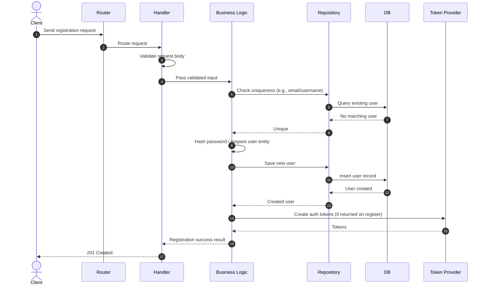
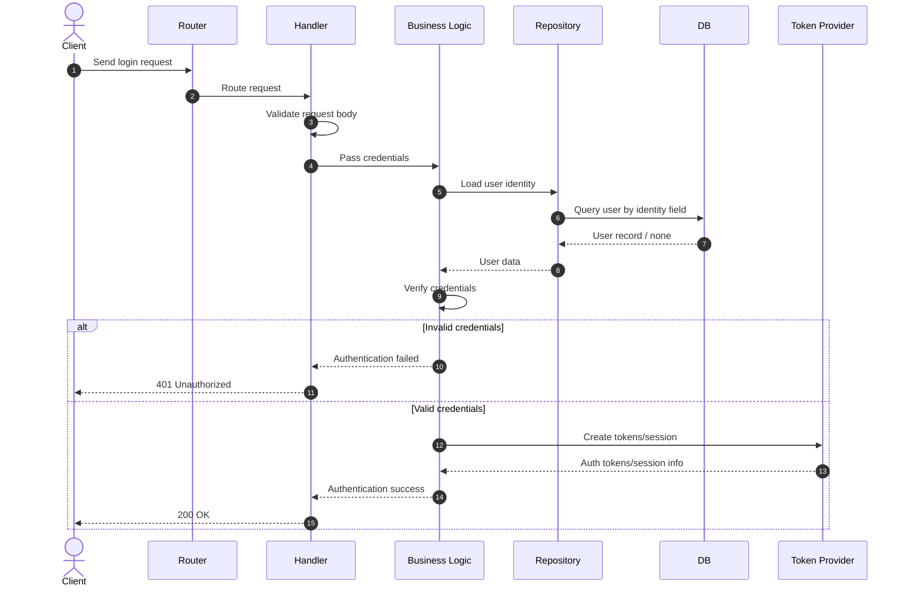
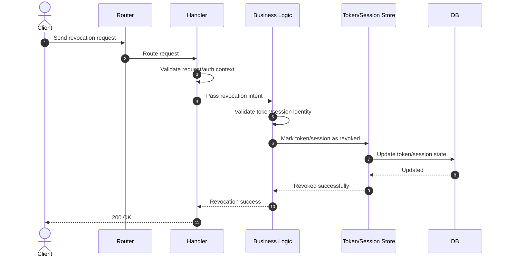
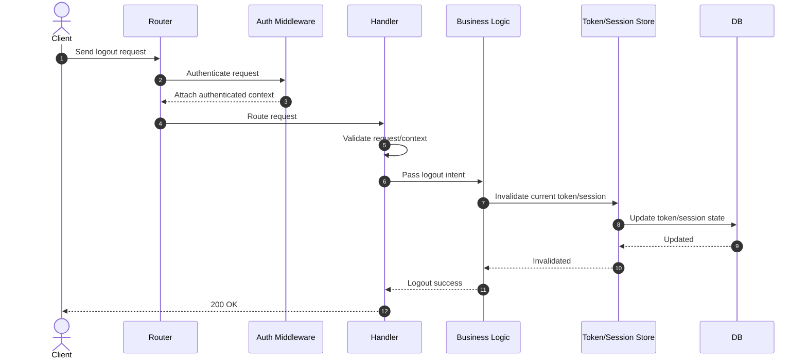

## Registration Flow TYPE POST 

```mermaid
sequenceDiagram
    autonumber
    actor Client
    participant Router
    participant Handler
    participant BusinessLogic as Business Logic
    participant Repository
    participant DB
    participant TokenProvider as Token Provider

    Client->>Router: Send registration request
    Router->>Handler: Route request
    Handler->>Handler: Validate request body
    Handler->>BusinessLogic: Pass validated input

    BusinessLogic->>Repository: Check uniqueness (e.g., email/username)
    Repository->>DB: Query existing user
    DB-->>Repository: No matching user
    Repository-->>BusinessLogic: Unique

    BusinessLogic->>BusinessLogic: Hash password / prepare user entity
    BusinessLogic->>Repository: Save new user
    Repository->>DB: Insert user record
    DB-->>Repository: User created
    Repository-->>BusinessLogic: Created user

    BusinessLogic->>TokenProvider: Create auth tokens (if returned on register)
    TokenProvider-->>BusinessLogic: Tokens

    BusinessLogic-->>Handler: Registration success result
    Handler-->>Client: 201 Created
```

## Authentication flow TYPE POST 

```mermaid
sequenceDiagram
    autonumber
    actor Client
    participant Router
    participant Handler
    participant BusinessLogic as Business Logic
    participant Repository
    participant DB
    participant TokenProvider as Token Provider

    Client->>Router: Send login request
    Router->>Handler: Route request
    Handler->>Handler: Validate request body
    Handler->>BusinessLogic: Pass credentials

    BusinessLogic->>Repository: Load user identity
    Repository->>DB: Query user by identity field
    DB-->>Repository: User record / none
    Repository-->>BusinessLogic: User data

    BusinessLogic->>BusinessLogic: Verify credentials
    alt Invalid credentials
        BusinessLogic-->>Handler: Authentication failed
        Handler-->>Client: 401 Unauthorized
    else Valid credentials
        BusinessLogic->>TokenProvider: Create tokens/session
        TokenProvider-->>BusinessLogic: Auth tokens/session info
        BusinessLogic-->>Handler: Authentication success
        Handler-->>Client: 200 OK
    end

```

## revocation flow TYPE POST  

```mermaid
sequenceDiagram
    autonumber
    actor Client
    participant Router
    participant Handler
    participant BusinessLogic as Business Logic
    participant TokenStore as Token/Session Store
    participant DB

    Client->>Router: Send revocation request
    Router->>Handler: Route request
    Handler->>Handler: Validate request/auth context
    Handler->>BusinessLogic: Pass revocation intent

    BusinessLogic->>BusinessLogic: Validate token/session identity
    BusinessLogic->>TokenStore: Mark token/session as revoked
    TokenStore->>DB: Update token/session state
    DB-->>TokenStore: Updated
    TokenStore-->>BusinessLogic: Revoked successfully

    BusinessLogic-->>Handler: Revocation success
    Handler-->>Client: 200 OK
```

## Logout flow  TYPE POST 

```mermaid
sequenceDiagram
    autonumber
    actor Client
    participant Router
    participant AuthMiddleware as Auth Middleware
    participant Handler
    participant BusinessLogic as Business Logic
    participant TokenStore as Token/Session Store
    participant DB

    Client->>Router: Send logout request
    Router->>AuthMiddleware: Authenticate request
    AuthMiddleware-->>Router: Attach authenticated context
    Router->>Handler: Route request

    Handler->>Handler: Validate request/context
    Handler->>BusinessLogic: Pass logout intent

    BusinessLogic->>TokenStore: Invalidate current token/session
    TokenStore->>DB: Update token/session state
    DB-->>TokenStore: Updated
    TokenStore-->>BusinessLogic: Invalidated

    BusinessLogic-->>Handler: Logout success
    Handler-->>Client: 200 OK
``` 

