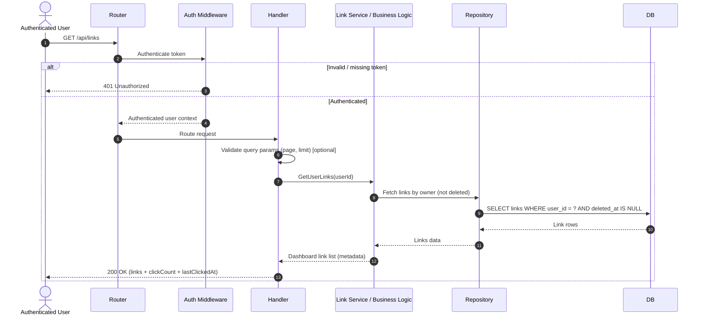
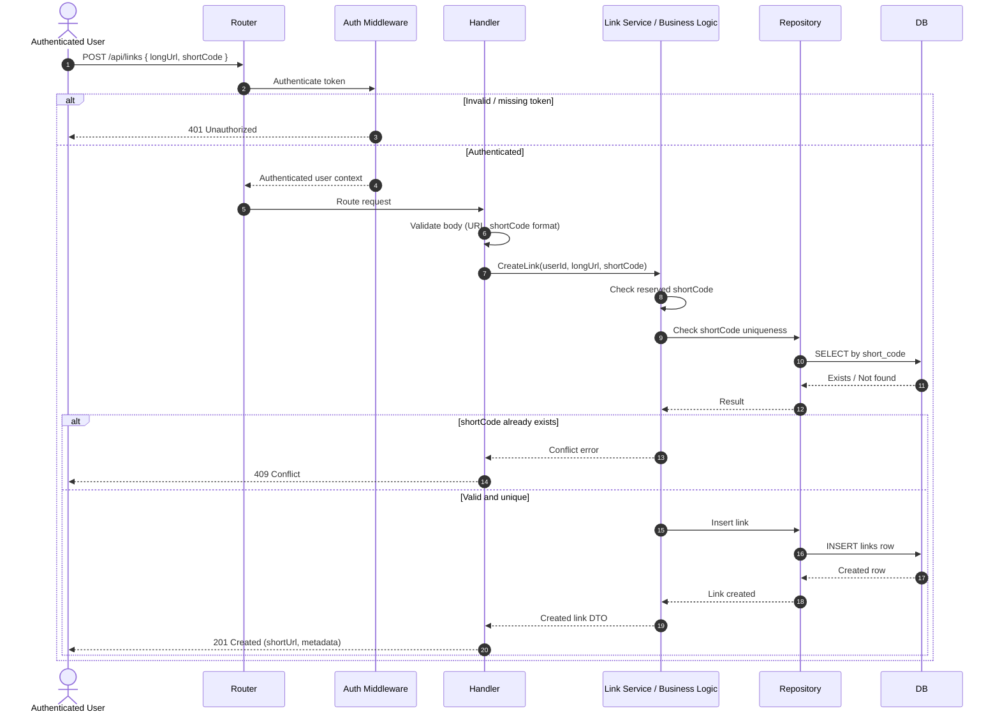
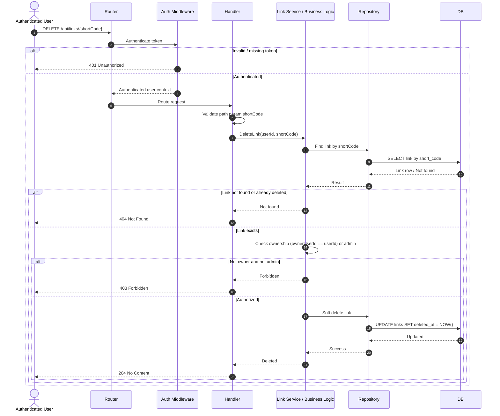
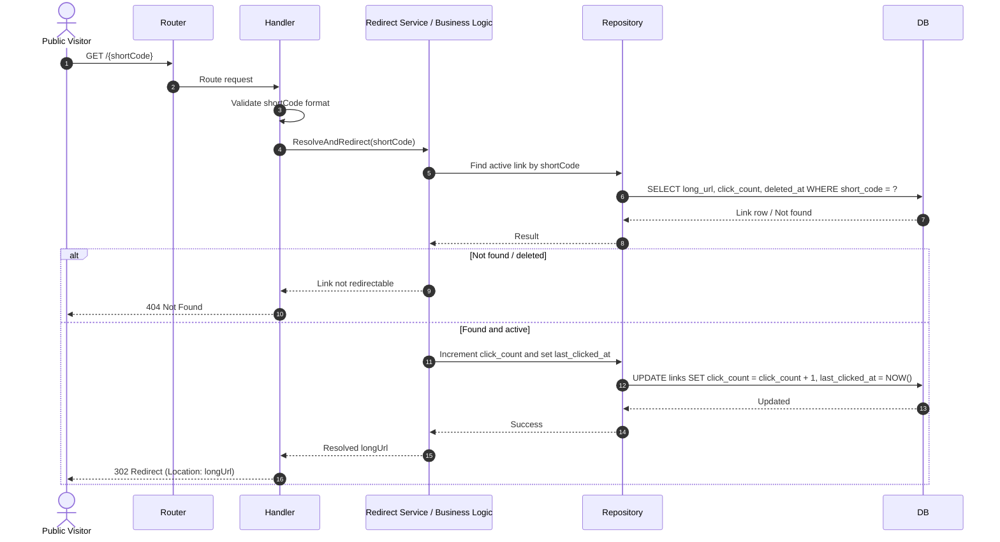

## Dashboard / List My Links (Authenticated) GET /api/links

## Create Short Link (Authenticated) — POST /api/links

## Delete Short Link (Authenticated, Owner Only) — DELETE /api/links/:shortCode

## Public Redirect (No Auth) — GET /:shortCode

