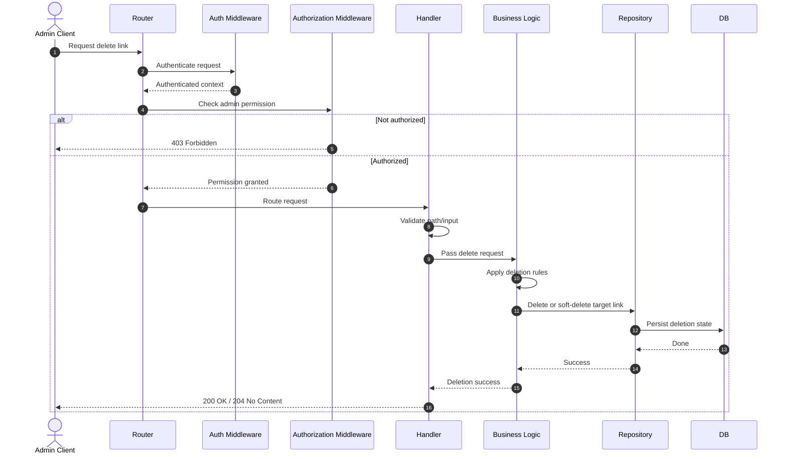
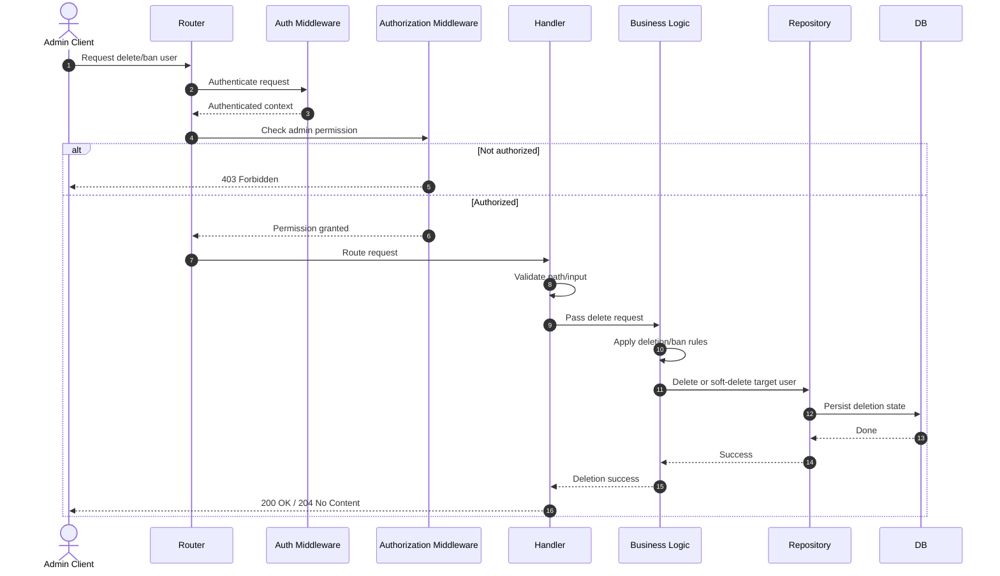

# Admin Moderation Flows

## Link Deletion (POST)



## GET USER LIST (GET)



## GET Link List + Metadata (GET)


```mermaid
sequenceDiagram
    autonumber
    actor Admin as Admin Client
    participant Router
    participant AuthMiddleware as Auth Middleware
    participant AuthorizationMiddleware as Authorization Middleware
    participant Handler
    participant BusinessLogic as Business Logic
    participant Repository
    participant DB

    Admin->>Router: Request links list (with pagination)
    Router->>AuthMiddleware: Authenticate request
    AuthMiddleware-->>Router: Authenticated context
    Router->>AuthorizationMiddleware: Check admin permission

    alt Not authorized
        AuthorizationMiddleware-->>Admin: 403 Forbidden
    else Authorized
        AuthorizationMiddleware-->>Router: Permission granted
        Router->>Handler: Route request
        Handler->>Handler: Validate query params
        Handler->>BusinessLogic: Pass pagination/filter input

        BusinessLogic->>Repository: Fetch paginated links
        Repository->>DB: Query paginated link rows
        DB-->>Repository: Link rows
        Repository-->>BusinessLogic: Items

        BusinessLogic->>Repository: Fetch total count
        Repository->>DB: Query total count
        DB-->>Repository: Count
        Repository-->>BusinessLogic: Total

        BusinessLogic-->>Handler: List result + pagination metadata
        Handler-->>Admin: 200 OK
    end
 ```
 
 
